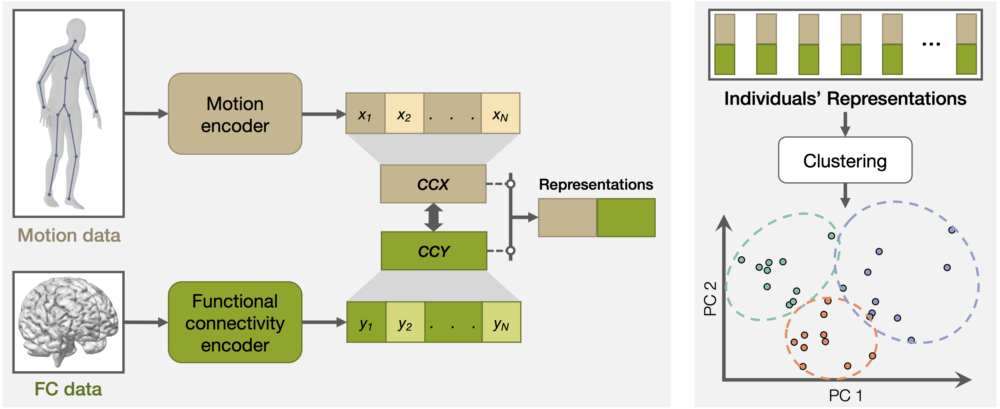

# Data-Driven Parkinson’s Disease Subtyping and Digital Biomarker Discovery by Correlating Video-Captured Gait with rs-fMRI Brain Connectivity

This repository contains code for a data-driven Parkinson's disease subtyping approach using motion and brain functional connectivity.



## System Requirements

The code has been tested on Linux operating systems (Ubuntu 20.04). All package requirements are located in `requirements.txt`.

## Installation guide

Run the following commands with Python 3.7:
```
git clone https://github.com/markendo/PD-Subtyping-Motion-Brain.git
cd PD-Subtyping-Motion-Brain

pip install -r requirements.txt
```
The package should take a few minutes to install on a standard computer.

## Demo

We have provided a [notebook](src/demo_analyze_subtypes.ipynb) containing subtype analysis on a toy dataset. The expected output is included in the notebook.

## Results
We also include notebooks containing the workflows for generating [full subtype analysis results](src/analyze_subtypes_private_data.ipynb) and [fMRI subnetwork analysis results](src/fc_motor_impairment_pred.ipynb). 

To run on your own data, first extract motion encoder outputs from [this repo](https://github.com/markendo/GaitForeMer) and place them at `data/motion_encoder_outputs`. Corresponding FC data should be stored at `data/fc_data`.